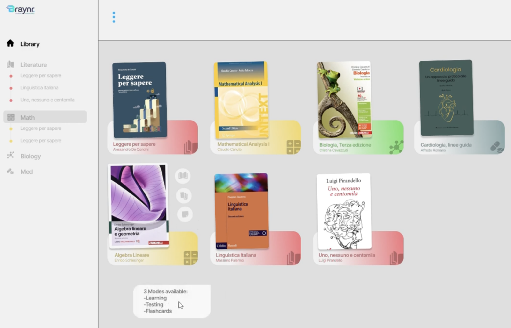
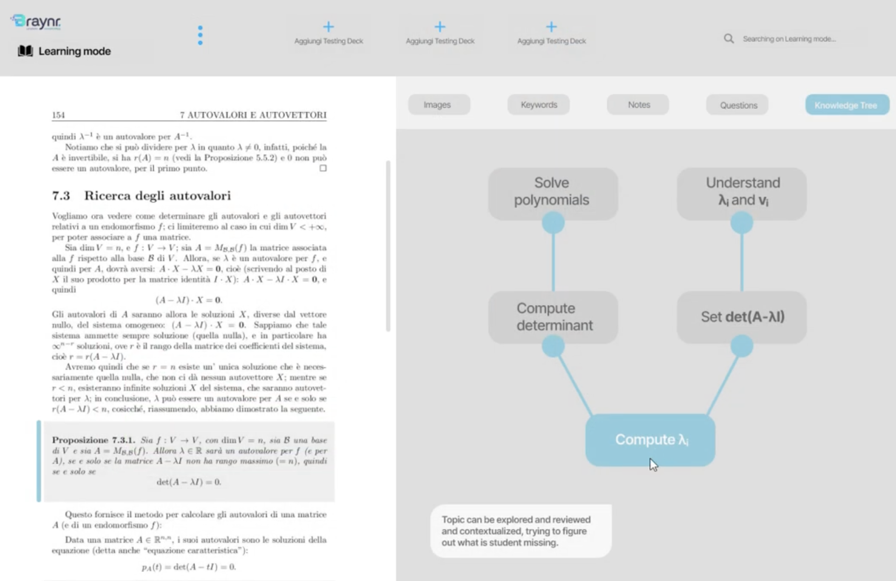

# GDG AI Edutech Agents

<a href="https://youtu.be/9GySLojH2JM?si=wyN36dE_AzLe8nh3" target="_blank">
  
</a>


**GDG AI Edutech Agents** was built during **GDG AI Hack 2025 (Milan)**-event sponsored by **Google, ASUS and Braynr**. Our team reached the *final round* by shipping:

* a **live demo** that plugs directly into **Braynr**, ADC’s desktop learning app;  
* an innovative testing pipeline that auto-generates exercises, checks answers, and generates a knowledge graph;  
* a modular back-end of **Google ADK Agents** (Gemini + FAISS + Wolfram Alpha).

The system turns any PDF textbook into an interactive study journey: indexing content, creating flashcards and problems, verifying results, and building a concept-dependency graph for instant, targeted review.

## Table of Contents

- [Features](#features)  
- [Objectives and How to Achieve Them](#objectives-and-how-to-achieve-them)
- [Installation](#installation)  
- [Configuration](#configuration)  
- [Running](#running)
- [Contributing](#contributing)  
- [License](#license)  


## Features

- **PDF Extraction**  
  Uses Gemini embeddings and FAISS to index and retrieve passages from a PDF textbook.

- **Exercise Generation**  
  Creates hands-on exercises (flashcards, problem statements, true/false, multiple choice, open questions) based on the textbook content. 

- **Automatic Solving**  
  Leverages Wolfram Alpha for complex calculations within the solution pipeline.

- **Advanced Feedback**  
  After each exercise batch, provides detailed step-by-step explanations and generates a knowledge dependency graph.


## Objectives and How to Achieve Them

### Introduction

We are HPC students. Verifying mastery of STEM subjects like ours is challenging—it requires practical application of theory and reinforcement of any gaps.

### Current State

At present, the flashcards offered by Braynr are not a complete solution: they lack the practical exercise component of technical subjects. Moreover, the stages of acquisition (reading), comprehension, elaboration, application (testing), and recall are all handled in a single interface.

### Proposed Solution

We introduce a testing mode that enriches flashcards with practical exercises (e.g., computing the eigenvalues of a matrix). The question modes include:
- **Flashcards** (definitions, theorem statements)  
- **Exercises** (problem solving, proofs)  
- **True/False**  
- **Multiple Choice**  

Students can either type their answers or upload them via OCR. Testing is done in batches of cards (e.g., 10), either mixed or user-selected. At the end of each batch:
- Detailed explanation of the solution process  
- Generation of a knowledge dependency graph (*Future implementation...*)

[](demo/Demo%20ThreadSetters%20GDG%20AI.mp4)

The graph links concepts and topics to the corresponding textbook sections (or external sources) and to specific exercise steps. The interface separates the workflow into three phases:
1. Reading, comprehension, and elaboration  
2. Application / Testing  
3. Recall (Flashcards)  

The system adapts to each student’s existing knowledge, interests, and difficulties.


## Installation

1. **Clone the repository**  
   ```bash
   git clone https://github.com/GiacomoPauletti/gdg-ai-edutech-agents.git
   cd gdg-ai-edutech-agents
    ````

2. **(Optional) Create a virtual environment**

   ```bash
   python3 -m venv venv
   source venv/bin/activate
   ```

3. **Install dependencies**

   ```bash
    pip install 
    google-adk \
    langchain \
    langchain-community \
    langchain-google-genai \
    faiss-cpu \
    wolframalpha \
    numpy \
    pypdf
   ```


## Configuration

Rename or create a `.env` file with the following variables:

```dotenv
GOOGLE_GENAI_USE_VERTEXAI=0
GOOGLE_API_KEY=<YOUR_KEY_HERE>
BOOK_PATH=<YOUR_PATH_TO_THE_BOOK>
```

> **Note:** Add `.env` to `.gitignore` to avoid exposing your keys.


## Running

```bash
adk web
```


## Contributing

- Valerio Grillo
- Giacomo Pauletti
- Alberto Taddei
- Mattia Rocco


## License

This project is released under the MIT License.
